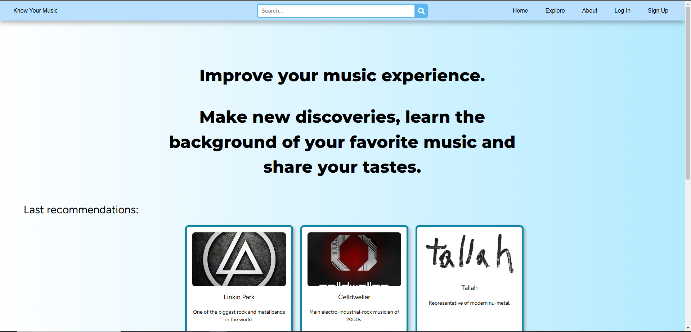

# Know Your Music
## Projekta ideja
**"Know Your Music"** ir mūzikai un mūziķiem veltīta tīmekļa vietne, kas apvieno mūzikas enciklopēdijas un rekomendāciju servisa funkcijas.

## Funkcijas
Tīmekļa vietne piedavās tādu funkcionalitāti:
1. Mūzikas meklēšana pēc žanra, izpildītāja vai dziesmas vārda vai arī dziesmas teksta;
2. Mūziķu un grupu profili ar detalizētu informāciju par viņiem, ieskaitot biogrāfiju, diskogrāfiju un gaidāmos jaunos darbus;
3. Dziesmu tekstus;
4. Personalizētu rekomendāciju sistēma, pamatojoties uz lietotāja preferencēm;

### Izveidoto funkciju saraksts:
- [ ] Mūzikas meklēšana
- [ ] Mūziķu un grupu profili
- [ ] Dziesmu teksti
- [ ] Rekomendācijas

## Līdzīgas sistēmas
Galvenie konkurenti ir *Last.fm*, *Genius.com* un *Lyrics.com*. *Spotify* nav uzskatīts par projekta konkurentu, jo *Know Your Music* nav paredzēts mūzikas klausīšanai un straumēšanai.

### Progress
- Home page ✓
- Navbar ✓
- Footer ✓
- Responsivitāte ✓
- Laravel framework uzstādīts ✓
- Log In lapa ✓
- Sign Up lapa ✓
- 